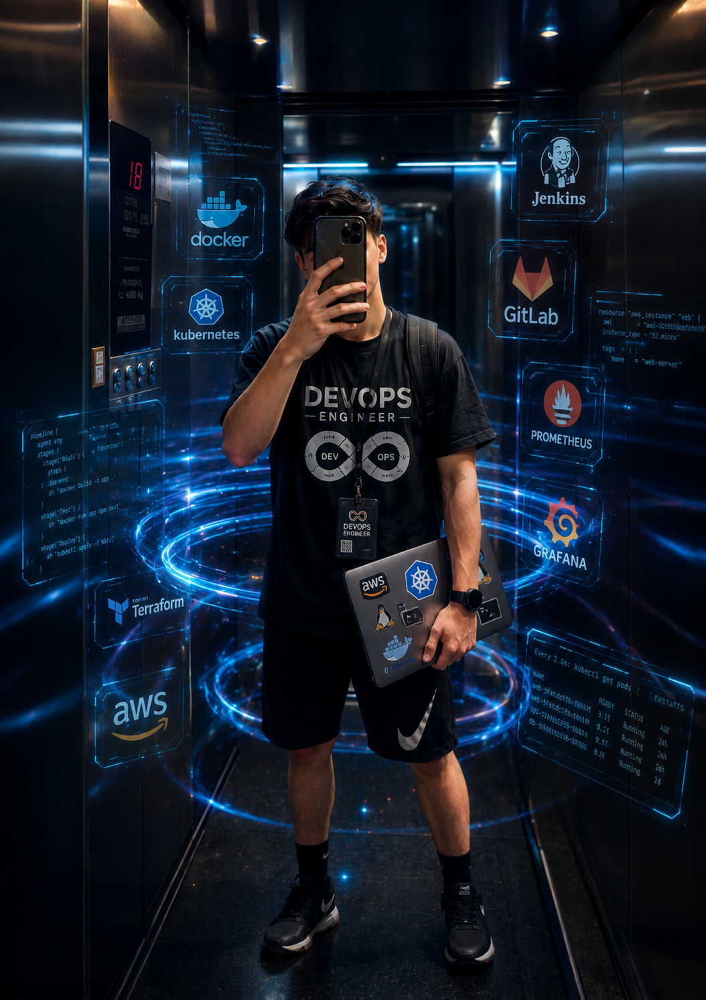
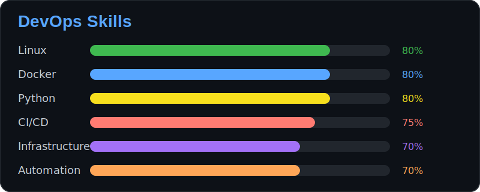
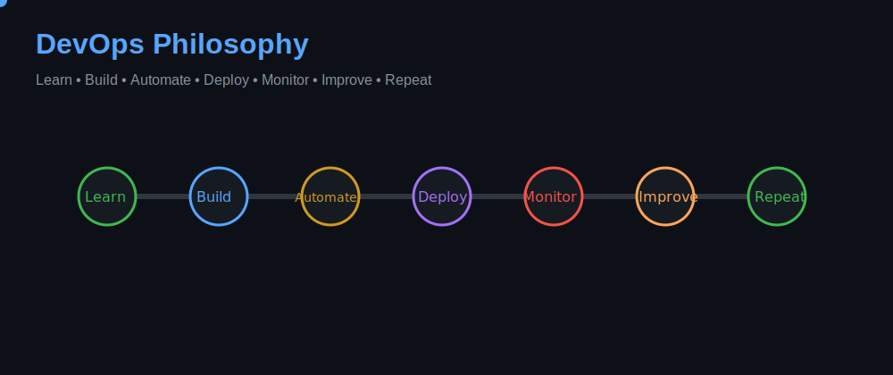

# 👋 Hi, I'm Saman Qasempour

### 🚀 DevOps Engineer

 

---

  

<svg width="1000" height="340" viewBox="0 0 1000 340" fill="none" xmlns="http://www.w3.org/2000/svg">

  <defs>
    <linearGradient id="neon" x1="0" y1="0" x2="1" y2="1">
      <stop offset="0%" stop-color="#00F5FF"/>
      <stop offset="50%" stop-color="#7C3AED"/>
      <stop offset="100%" stop-color="#00FF85"/>
    </linearGradient>

    <filter id="glow">
      <feGaussianBlur stdDeviation="6" result="blur"/>
      <feMerge>
        <feMergeNode in="blur"/>
        <feMergeNode in="SourceGraphic"/>
      </feMerge>
    </filter>

    <pattern id="grid" width="40" height="40" patternUnits="userSpaceOnUse">
      <path d="M 40 0 L 0 0 0 40" fill="none" stroke="#1F2937" stroke-width="0.5"/>
    </pattern>
  </defs>

  <!-- Background -->
  <rect width="1000" height="340" rx="20" fill="#0D1117"/>
  <rect width="1000" height="340" rx="20" fill="url(#grid)" opacity="0.35"/>

  <!-- Header -->
  <text x="40" y="70" fill="url(#neon)" font-size="32" font-family="monospace" filter="url(#glow)">
    🚀 Saman | DevOps Engineer
  </text>

  <!-- DevOps Stack -->
  <text x="40" y="120" fill="#58A6FF" font-size="18" font-family="monospace">
    🐧 Linux • 🐳 Docker • ⚙️ CI/CD • ☁️ Kubernetes • 🔒 Security
  </text>

  <text x="40" y="155" fill="#A5D6FF" font-size="18" font-family="monospace">
    🐍 Python Automation • 📡 Networking • 🧠 System Design
  </text>

  <text x="40" y="190" fill="#FACC15" font-size="18" font-family="monospace">
    📐 Math-Physics Student • 👨‍💻 DevOps Engineer @ Nibero Team
  </text>

  <text x="40" y="225" fill="#7EE787" font-size="18" font-family="monospace">
    ☁️ Cloud Infrastructure • 🧩 Microservices • 🚀 CI/CD Pipelines
  </text>

  <text x="40" y="280" fill="#00FF85" font-size="16" font-family="monospace" filter="url(#glow)">
    📚 Always learning. Always building. Always scaling systems.
  </text>

</svg>

---

## 🛠️ Tech Stack

---

## ☁️ Cloud & DevOps Ecosystem

---

  

---

  

---

## 📊 GitHub Statistics

---

## 🔥 GitHub Streak

---

## 📈 Contribution Graph

---

## 📫 Connect With Me

* 📧 Email: **[samann1389@gmail.com](mailto:samann1389@gmail.com)**
* 💬 Telegram: **@Saman_Qasempour**

---

  

`

---

### 🚀 Building Reliable Infrastructure One Commit at a Time

