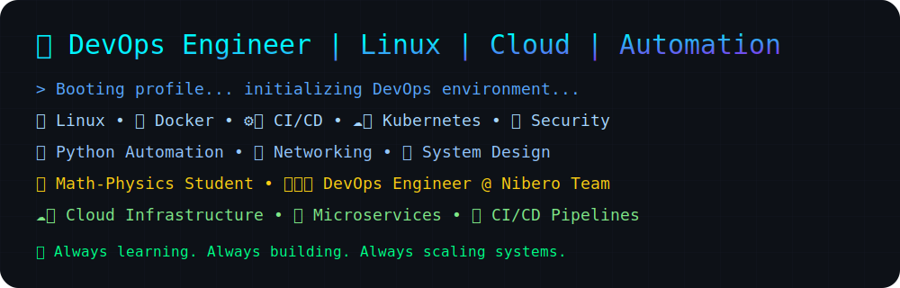

# 👋 Hi, I'm Saman Qasempour

### 🚀 DevOps Engineer

 

---

  

---

## 💻 Tech Stack

  

### 👨‍💻 Programming Languages

  

### ⚙️ DevOps & Cloud

  

### 📊 Monitoring & Databases

  

### 🛠 Development Tools

  

### 🚀 Additional Skills

---

## ☁️ Cloud & DevOps Ecosystem

---

  

---

  

---

## 🔥 GitHub Streak

---

## 📈 Contribution Graph

---

---

  

`

---

### 🚀 Building Reliable Infrastructure One Commit at a Time

